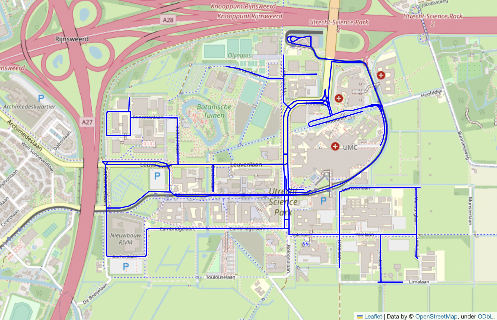
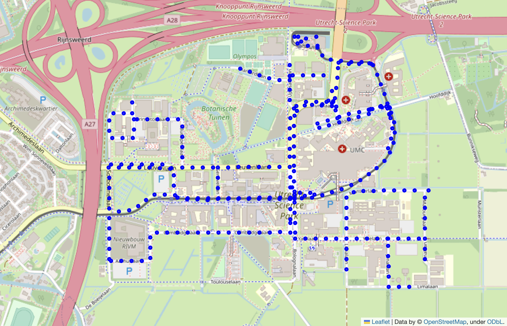
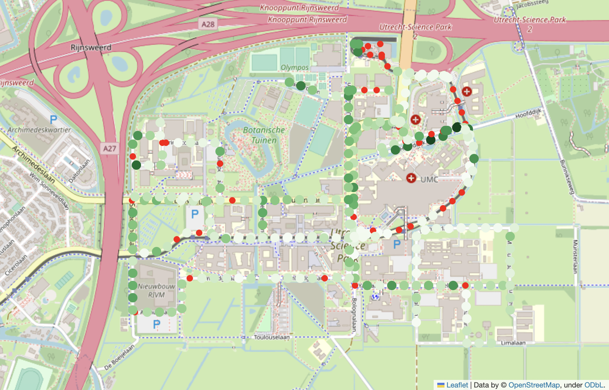
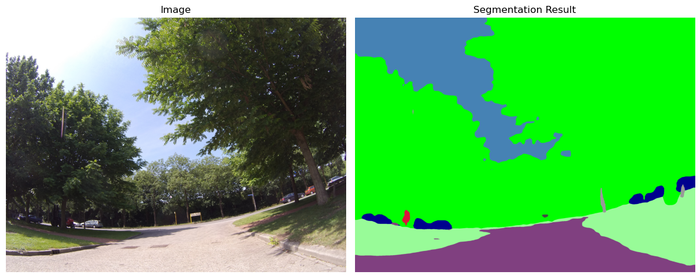
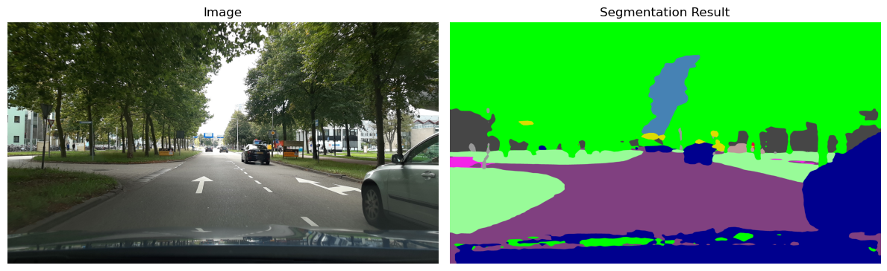
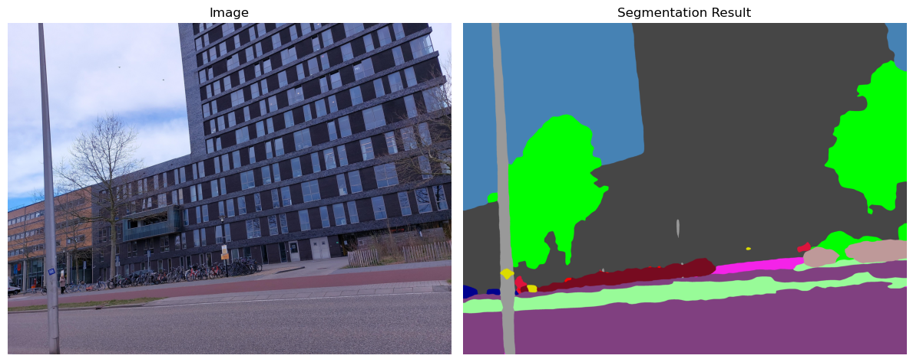

# Automated Street View Index Calculation Pipeline using Mapillary Street Images

- [Project Progress](#project-progress)
- [Setting up the environment](#setting-up-the-environment)
  - [Running in a local environment](#running-in-a-local-environment)
  - [Running in Google Colab](#running-in-google-colab)
- [Explaining the Pipeline](#explaining-the-pipeline)
  - [Step 1. Get the road network](#step-1-get-the-road-network)
  - [Step 2. Select the sample points on the road network](#step-2-select-the-sample-points-on-the-road-network)
  - [Step 3. Assign features from Mapillary to each point based on their proximity](#step-3-assign-features-from-mapillary-to-each-point-based-on-their-proximity)
  - [Step 4. Downloading and processing images associated with the points to calculate the Green View Index](#step-4-downloading-and-processing-images-associated-with-the-points-to-calculate-the-green-view-index)


<br><br> 

## Project progress
This section tracks the progress of the project. The following table shows the progress made each week:

<table border="1" class="dataframe">
  <thead>
    <tr>
      <th>Week</th>
      <th>Task</th>
    </tr>
  </thead>
  <tbody>
    <tr>
      <th>1</th>
      <td>Read papers on previous related work</td>
    </tr>
    <tr>
      <th>2</th>
      <td>Worked on the code to download the street view images that will be used to model nature visibility in urban environments.<br><br>I created a Jupyter notebook that retrieves the road network of the selected place using OSMnx, selects points on the roads, retrieves features for each point, and downloads corresponding images. The notebook includes four main sections: <br><ol><li>Retrieving the road network and saving it as a GeoPackage file</li><li>Selecting points on the road edges</li><li>Downloading features for each point and matching them to each point</li><li>Downloading images for each point and saving them locally</li></ol></td>
    </tr>
    <tr>
      <th>3</th>
      <td>I completed the following tasks:<br><ol><li>Added image segmentation using facebook/mask2former-swin-large-cityscapes-semanic. This enables the code to segment street images into differet regions based on their content. By leveraging this segmentation, we can subsequently identify the road centers and calculate the GVI (Green View Index) value. </li><li>Implemented code to find the center of the roads in street images following the approach proposed by Matthew Danis. This allows for the classification of images as usable or unusable based on the presence of a road centre.</li> </td>
    </tr>
    <tr>
      <th>4</th>
      <td>My focus was on cropping the panoramic images to ensure a consistent approach across the dataset. Moreover, I wrote the necessary code to calculate the GVI for each point and stored the results in a GeoDataFrame.</td>
    </tr>
    <tr>
      <th>5</th>
      <td>I helped Yúri in modifying the code to enable the calculation of GVI for a group of address points. Moreover, I divided the pipeline into separate components, allowing independent execution of point sampling, image downloading, and image processing. Furthermore, I initiated the execution of the code in not only Kampala, Uganda but also in Amsterdam, Netherlands.</td>
    </tr>
    <tr>
      <th>6</th>
      <td>
      I fixed some bugs found in the code such as:
      <ul><li>Resolved the problem with bidirectional streets in osmnx where two lines were retrieved with exchanged starting and ending points. Modified the code to keep only one line for such streets, resolving conflicts in the sample points.</li><li>Addressed the issue of images being assigned to multiple points. Implemented a solution by converting the CRS from degrees to meters and creating a 50-meter buffer. Found the closest image within the buffer for each point. If no images were available within the 50-meter radius, it was considered a missing image.</li><li>Fixed a multiprocessing problem that allowed multiple processes to edit the CSV file simultaneously, resulting in missing or incomplete rows. Introduced a lock variable to control access to the results list for each process. All process results are now correctly stored in the CSV file at the end.</li></ul>
      I ran the code for the following cities:<br><ul><li>Kampala, Uganda</li><li>Amsterdam, Netherlands</li><li>Mexico City, Mexico</li><li>Dhaka, Bangladesh</li></ul></td>
    </tr>
    <tr>
      <th>7</th>
      <td>I ran the code for the following cities:<li>Tel Aviv, Israel</li><li>Seattle, USA</li><li>Melbourne, Australia</li>
      Also, I started creating visualisations to show the results of GVI per city in maps, as well as for some metrics such as:<ul><li>Adjusted Availability Score</li><li>Raw missing score</li><li>Percentage of unavailable images</li><li>Percentage of unsuitable images</li></ul>
      Additionally, I updated the README file with instructions about how to create set up the environment to run the code in Google Colab or in a local environment, as well as information about the pipeline. I am also starting to write the introduction and literature review.</td>
    </tr>
  </tbody>
  <tr>
      <th>8</th>
      <td>I created a Jupyter Notebook for Google Colab that simplifies the usage of the project by allowing users to run each cell of the notebook without the need to manually download files from the GitHub repository and upload them to Google Colab. Detailed instructions on how to use the notebook are provided in the README file.<br>
      Additionally, I am currently running the code to calculate the GVI (Green Vegetation Index) value from the NDVI (Normalized Difference Vegetation Index) value using linear regression and linear GAM (Generalized Additive Model) for all the cities.<br>
      Furthermore, I have begun writing the methodology section for the written component of the project.<td>
    </tr>
  </tbody>
</table>

<br><br> 

## Setting up the environment

### Running in a local environment
To create a Conda environment and run the code using the provided YAML file, follow these steps:

<ol>
  <li><b>Cloning GitHub Repository:</b>Open a terminal or command prompt on your computer and navigate to the directory where you want to clone the GitHub repository using the following commands:
  
  <ol>
  <li>Use the <b>cd</b> command to change directories. For example, if you want to clone the repository in the "Documents" folder, you can use the following command:
    
  ```bash
  cd Documents
  ```
  </li>
  <li>Clone the GitHub repository named "StreetView-NatureVisibility" by executing the following command:

  ```bash
  git clone https://github.com/Spatial-Data-Science-and-GEO-AI-Lab/StreetView-NatureVisibility.git
  ```
  This command will download the repository and create a local copy on your computer.
  </li>
  <li>Once the cloning process is complete, navigate to the cloned repository by using the cd command:

  ```bash
  cd StreetView-NatureVisibility
  ```
  </li>
  </ol>
  </li>
  <li><b>Create a Conda environment using the provided YAML file</b>: Run the following command to create the Conda environment:

  ```bash
  conda env create -f adsthesis.yml
  ```
  This command will read the YAML file and start creating the environment with the specified dependencies. The process may take a few minutes to complete.
  </li>
  <li><b>Activate conda environment</b>: After the environment creation is complete, activate the newly created environment using the following command:
  
  ```bash
  conda activate adsthesis
  ```
  </li>
  <li><b>Compute GVI index</b>: Once the environment is activated, you can start using the project. To run the code and analyze the Green View Index of a specific place, open the terminal and execute the following command:
  
  ```bash
  python main_script.py place distance access_token file_name max_workers begin end
  ```

  Replace the following parameters with appropriate values:
    
  <ul>
    <li><b>place</b>: indicates the name of the place that you want to analyze. In this specific example, we will analyse the Green View Index in Utrecht Science Park, so it is set to 'De Uithof, Utrecht'. You can replace it with the name of any other city, neighbourhood or even street you want to analyze.</li>
    <li><b>distance</b>: Represents the distance between sample points in meters. For this example, it's set to 50 meters. This value determines the spacing between the analyzed points.</li>
    <li><b>access_token</b>: Access token for Mapillary (e.g. MLY|). If you don't have an access token yet, you can follow the instructions on <a href="https://help.mapillary.com/hc/en-us/articles/360010234680-Accessing-imagery-and-data-through-the-Mapillary-API#h_ed5f1c3b-8fa3-432d-9e94-1e474cbc1868">this webpage</a></li>
    <li><b>file_name</b>: Represents the name of the CSV file where the points with the GVI (Green View Index) value will be stored. The provided example file name is "sample-file". You can change it to any desired name for your output file.</li>
    <li><b>max_workers</b>:  Indicates the number of threads to be used. A good starting point is the number of CPU cores in the computer running the code. However, you can experiment with different thread counts to find the optimal balance between performance and resource utilization. Keep in mind that this may not always be the maximum number of threads or the number of CPU cores.</li>
    <li><b>begin</b> and <b>end</b>: Define the range of points to be analyzed. In this example, the range is set from 0 to 20, meaning that the script will analyze the first 20 points. If desired, you can omit these parameters, allowing the code to run for the entire dataset. However, specifying the range can be useful, especially if the code stops running before analyzing all the points.</li>
  </ul>
  </li>
  <li><b>Generate GeoPackage Files (Optional)</b>: After retrieving the GVI data, you have the option to generate GeoPackage files from the obtained CSV files. This step can be executed by running the following command in the terminal:

  ```bash
  python get_gvi_gpkg.py place
  ```
  </li>
  <li><b>Compute Mean GVI per Street (Optional)</b>: Additionally, you can compute the mean Green View Index (GVI) value per street in the road network. To perform this computation, run the following command in the terminal:
  
  ```bash
  python mean_gvi_street.py place
  ```
  </li>
  <li><b>Accessing Results</b>: Once the analysis is completed, you can navigate to the cloned repository directory on your local computer. Inside the repository, you will find a folder named results. Within the results folder, there will be a subfolder named after the location that was analyzed. This subfolder contains several directories, including:
  <ul>
    <li><b>roads</b>: This directory contains the road network GeoPackage file, which provides information about the road infrastructure in the analyzed area.</li>
    <li><b>points</b>: Here, you can find the sample points GeoPackage file, which includes the spatial data of the sampled points used in the analysis.</li>
    <li><b>gvi</b>: Initially, this directory contains the CSV file generated during the analysis. It includes the calculated Green View Index (GVI) values for each sampled point. Additionally, if the script for computing the mean GVI per street was executed, this directory will also contain a GeoPackage (GPKG) file with the GVI values aggregated at the street level.</li>
  </li>
</ol>

<br>

### Running in Google Colab
To run the project in Google Colab, you can use [this notebook](https://drive.google.com/file/d/167yvLeW2ZXnOPTZlZAaNV5Aqi_7My_sf/view?usp=sharing) which contains the following cells:

<ol>
  <li><b>Configure GPU</b>: Before running the Jupyter Notebook, it is recommended to configure it to use a GPU. Follow these steps:
    <ol>
      <li>Go to the "Runtime" menu at the top.</li>
      <li>Select "Change runtime type" from the dropdown menu.</li>
      <li>In the "Runtime type" section, choose "Python 3".</li>
      <li>In the "Hardware accelerator" section, select "GPU".</li>
      <li>In the "GPU type" section, choose "T4" if available.</li>
      <li>In the "Runtime shape" section, select "High RAM".</li>
      <li>Save the notebook settings</li>
    </ol>
  </li>

  <li><b>Install Required Libraries</b>: The notebook begins by installing the necessary libraries that are not already installed in the Google Colab environment. This step ensures that all the required dependencies are available for the notebook's execution.

  ```python
  %pip install transformers==4.29.2
  %pip install geopandas=0.12.2
  %pip install torch==1.13.1
  %pip install vt2geojson==0.2.1
  %pip install mercantile==1.2.1
  %pip install osmnx==1.3.0
  ```
  </li>

  <li><b>Mount Google Drive</b>:  The notebook mounts the Google Drive to allow easy access to files and storage. This step enables uploading the project folder once and accessing it conveniently throughout the notebook.

  ```python
  from google.colab import drive

  drive.mount('/content/drive')

  %cd /content/drive/MyDrive
  ```
  </li>

  <li><b>Clone GitHub Repository (If Needed)</b>: The notebook checks if the GitHub repository named "StreetView-NatureVisibility" is already cloned in the Google Drive. If not, it proceeds to clone the repository using the 'git clone' command so the required scripts and files from the repository are available.

  ```python
  import os

  if not os.path.isdir('StreetView-NatureVisibility'):
    !git clone https://github.com/Spatial-Data-Science-and-GEO-AI-Lab/StreetView-NatureVisibility.git
  
  %cd StreetView-NatureVisibility
  ```
  </li>

  <li><b>Set Analysis Parameters</b>: For example:

  ```python
  place = 'De Uithof, Utrecht'
  distance = 50
  access_token = 'MLY|'
  file_name = 'amsterdam-gvi'
  max_workers = 6
  begin = None
  end = None

  ```
  In this example, the main_script.py file will be executed to analyze the Green View Index for Amsterdam, Netherlands.
  </li>

  <li><b>Retrieve Green View Index (GVI) Data</b>: The notebook executes a script ('main_script.py') to retrieve the Green View Index (GVI) data. The script takes the specified analysis parameters as input and performs the data retrieval process.
  
  ```python
  command = f'python main_script.py '{place}' {distance} '{access_token}' {file_name} {max_workers} {begin if begin is not None else ''} {end if end is not None else ''}'
  !{command}

  ```
  </li>
  <li><b>Generate GeoPackage Files (Optional)</b>: After retrieving the GVI data, the notebook executes another script ('get_gvi_gpkg.py') to generate GeoPackage files from the obtained CSV files. The generated GeoPackage files include the road network of the analyzed place, sample points, and the CSV file containing GVI values.

  ```python
  command = f"python get_gvi_gpkg.py '{place}'"
  !{command}

  ```
  </li>
  <li><b>Compute Mean GVI per Street (Optional)</b>: Additionally, the notebook provides the option to compute the mean Green View Index (GVI) value per street in the road network. Running a script ('mean_gvi_street.py') achieves this computation.
  
  ```python
  command = f"python mean_gvi_street.py '{place}'"
  !{command}

  ```
  </li>
  <li><b>Accessing Results</b>: Once the analysis is completed, you can access your Google Drive and navigate to the 'StreetView-NatureVisibility/results/' folder. Inside this folder, you will find a subfolder named after the location that was analyzed. This subfolder contains several directories, including:
    <ul>
      <li><b>roads</b>: This directory contains the road network GeoPackage file, which provides information about the road infrastructure in the analyzed area.</li>
      <li><b>points</b>: Here, you can find the sample points GeoPackage file, which includes the spatial data of the sampled points used in the analysis.</li>
      <li><b>gvi</b>: Initially, this directory contains the CSV file generated during the analysis. It includes the calculated Green View Index (GVI) values for each sampled point. Additionally, if the script for computing the mean GVI per street was executed, this directory will also contain a GeoPackage (GPKG) file with the GVI values aggregated at the street level.</li>
    </ul>
  </li>
</ol>

<br><br> 

## Explaining the Pipeline

For this explanation, Utrecht Science Park will be used. Therefore, the command should look like this:

```bash
python main_script.py 'De Uithof, Utrecht' 50 'MLY|' sample-file 8
```
When executing this command, the code will run the following steps.


### Step 1. Get the road network

The first step of the code is to retrieve the road network for a specific place using OpenStreetMap data with the help of the OSMNX library. It begins by fetching the road network graph, focusing on roads that are suitable for driving. One important thing to note is that for bidirectional streets, the osmnx library returns duplicate lines. In this code, we take care to remove these duplicates and keep only the unique road segments to ensure that samples are not taken on the same road multiple times, preventing redundancy in subsequent analysis.

Following that, the code proceeds to project the graph from its original latitude-longitude coordinates to a local projection in meters. This projection is crucial for achieving accurate measurements in subsequent steps where we need to calculate distances between points. By converting the graph to a local projection, we ensure that our measurements align with the real-world distances on the ground, enabling precise analysis and calculations based on the road network data.


```python
road = get_road_network(place)
```




### Step 2. Select the sample points on the road network

The second step of the code generates a list of evenly distributed points along the road network, with a specified distance between each point. This is achieved using a function that takes the road network data and an optional distance parameter N, which is set to a default value of 50 meters.

The function iterates over each road in the roads dataframe and creates points at regular intervals of the specified distance (N). By doing so, it ensures that the generated points are evenly spaced along the road network.

To maintain a consistent spatial reference, the function sets the Coordinate Reference System (CRS) of the gdf_points dataframe to match the CRS of the roads dataframe. This ensures that the points and the road network are in the same local projected CRS, measured in meters.

Furthermore, to avoid duplication and redundancy, the function removes any duplicate points in the gdf_points dataframe based on the geometry column. This ensures that each point in the resulting dataframe is unique and represents a distinct location along the road network.


```python
points = select_points_on_road_network(road, distance)
```


<table border="1" class="dataframe">
  <thead>
    <tr style="text-align: right;">
      <th></th>
      <th>geometry</th>
    </tr>
  </thead>
  <tbody>
    <tr>
      <th>0</th>
      <td>POINT (649611.194 5772295.371)</td>
    </tr>
    <tr>
      <th>1</th>
      <td>POINT (649609.587 5772345.345)</td>
    </tr>
    <tr>
      <th>2</th>
      <td>POINT (649607.938 5772395.318)</td>
    </tr>
    <tr>
      <th>3</th>
      <td>POINT (649606.112 5772445.285)</td>
    </tr>
    <tr>
      <th>4</th>
      <td>POINT (649604.286 5772495.252)</td>
    </tr>
  </tbody>
</table>




### Step 3. Assign features from Mapillary to each point based on their proximity

The next step in the pipeline focuses on finding the closest features (images) for each point.

To facilitate this process, the map is divided into smaller sections called tiles. Each tile represents a specific region of the map at a given zoom level. The XYZ tile scheme is employed, where each tile is identified by its zoom level (z), row (x), and column (y) coordinates. In this case, a zoom level of 14 is used, as it aligns with the supported zoom level in the Mapillary API.

The get_features_on_points function utilizes the mercantile.tile function from the mercantile library to determine the tile coordinates for each point in the points dataframe. By providing the latitude and longitude coordinates of a point, this function returns the corresponding tile coordinates (x, y, z) at the specified zoom level.

Once the points are grouped based on their tile coordinates, the tiles are downloaded in parallel using threads. The get_features_for_tile function constructs a unique URL for each tile and sends a request to the Mapillary API to retrieve the features (images) within that specific tile.

To calculate the distances between the features and the points, a k-dimensional tree (KDTree) approach is employed using the local projected crs in meters. The KDTree is built using the geometry coordinates of the feature points. By querying the KDTree, the nearest neighbors of the points in the points dataframe are identified. The closest feature and distance information are then assigned to each point accordingly.


```python
features = get_features_on_points(points, access_token, distance)
```

<table border="1" class="dataframe">
  <thead>
    <tr style="text-align: right;">
      <th></th>
      <th>geometry</th>
      <th>tile</th>
      <th>feature</th>
      <th>distance</th>
      <th>image_id</th>
      <th>is_panoramic</th>
      <th>id</th>
    </tr>
  </thead>
  <tbody>
    <tr>
      <th>0</th>
      <td>POINT (5.18339 52.08099)</td>
      <td>Tile(x=8427, y=5405, z=14)</td>
      <td>{'type': 'Feature', 'geometry': {'type': 'Poin...</td>
      <td>4.750421</td>
      <td>211521443868382</td>
      <td>False</td>
      <td>0</td>
    </tr>
    <tr>
      <th>1</th>
      <td>POINT (5.18338 52.08144)</td>
      <td>Tile(x=8427, y=5405, z=14)</td>
      <td>{'type': 'Feature', 'geometry': {'type': 'Poin...</td>
      <td>0.852942</td>
      <td>844492656278272</td>
      <td>False</td>
      <td>1</td>
    </tr>
    <tr>
      <th>2</th>
      <td>POINT (5.18338 52.08189)</td>
      <td>Tile(x=8427, y=5405, z=14)</td>
      <td>{'type': 'Feature', 'geometry': {'type': 'Poin...</td>
      <td>0.787206</td>
      <td>938764229999108</td>
      <td>False</td>
      <td>2</td>
    </tr>
  </tbody>
</table>


### Step 4. Downloading and processing images associated with the points to calculate the Green View Index

In this final step, the download_images_for_points function is responsible for efficiently downloading and processing images associated with the points in the GeoDataFrame to calculate the Green View Index (GVI). The function performs the following sub-steps:

1. Initialization and Setup: The function initializes the image processing models and prepares the CSV file for storing the results. It also creates a lock object to ensure thread safety during concurrent execution.

2. Image Download and Processing: The function iterates over the rows in the GeoDataFrame and submits download tasks to a ThreadPoolExecutor for concurrent execution. Each task downloads the associated image, applies specific processing steps, and calculates the GVI. The processing steps include:
    
    - Panoramic Image Handling: If the image is panoramic, the bottom 20% band, commonly present in panoramic images, is cropped to improve analysis accuracy.
    
    - Semantic Segmentation: The downloaded image undergoes semantic segmentation, which assigns labels to different regions or objects in the image.

    - Widened Panorama: For panoramic images, a widened panorama is created by wrapping the first 25% of the image onto the right edge. This step ensures a more comprehensive representation of the scene.
    
    - Road Centers Identification: The segmentation is analyzed to identify road centers, determining the suitability of the image for further analysis.
    
    - Cropping for Analysis: If road centers are found and the image is panoramic, additional cropping is performed based on the identified road centers. Otherwise, the original image and segmentation are used without modification.
    
    - GVI Calculation: The Green View Index (GVI) is calculated for all segmentations, representing the percentage of vegetation visible in the analyzed images.

3. Results Collection: The GVI results, along with the is_panoramic flag and error flags, are collected for each image. The results are written to a CSV file, with each row corresponding to a point in the GeoDataFrame, as soon as a thread finishes its task.

```python
results = download_images_for_points(features_copy, access_token, max_workers, place, file_name)
```



When the code ends running, there will be a folder in "results/{place}/gvi", which will contain a CSV file with the results. We can use it as a GeoDataframe using the following code.

```python
path = "results/De Uithof, Utrecht/gvi/gvi-points.csv"
results = pd.read_csv(path)

# Convert the 'geometry' column to valid Point objects
results['geometry'] = results.apply(lambda row: Point(float(row["x"]), float(row["y"])), axis=1)

# Convert the merged DataFrame to a GeoDataFrame
gdf = gpd.GeoDataFrame(results, geometry='geometry', crs=4326)
```

### Samples of images and segmentations
Images that are centered in the road are considered as suitable for this analysis. This selection was made based on the algorithm designed by [Matthew Danish](https://github.com/mrd/vsvi_filter).

**Suitable images for the analysis**



**Unsuitable images for the analysis**


